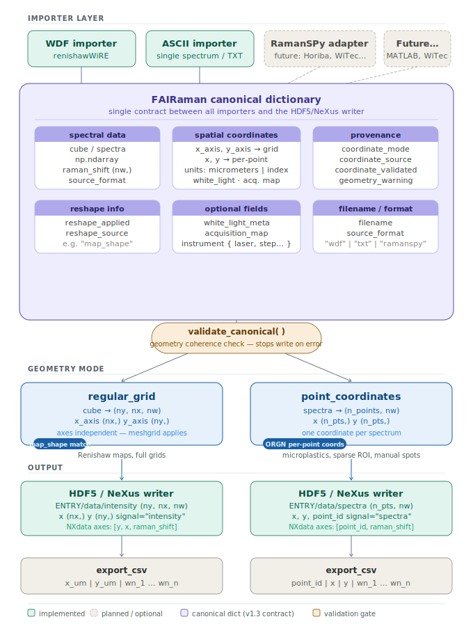

# FAIRaman


**FAIRaman** is an open-source Python tool for converting biomedical **Raman spectroscopy** measurements into **self-describing HDF5/NeXus files** enriched with clinical, biobanking, provenance, and acquisition metadata.

The aim is simple: keep the spectrum, the sample context, the donor/sample annotation, and the acquisition parameters together in one structured file, so that Raman datasets can be reused, compared, integrated, and analysed beyond the laboratory where they were produced.

FAIRaman is designed for clinical and translational Raman spectroscopy, where the biological meaning of the sample is as important as the spectral matrix itself. In other words: no more lonely CSV files wandering through folders like tiny undocumented ghosts.

---

## What FAIRaman does

FAIRaman converts raw Raman spectral data into FAIR-oriented output files by combining:

- **PROJECT-level metadata**  
  study identity, funding, governance, authorship, licensing, accessibility, and keywords

- **SAMPLE-level metadata**  
  sample identity, provenance, donor information, diagnosis, anatomical site, processing, and biobanking descriptors inspired by **MIABIS v3**

- **ENTRY-level metadata**  
  Raman acquisition parameters, instrument information, laser settings, optical system, spectral data, coordinate provenance, and auxiliary images inspired by **NeXus/NXraman**

The output is an HDF5 file that contains both data and metadata in a predictable structure.

---

## Why FAIRaman

Biomedical Raman spectroscopy is increasingly used in clinical research, but datasets are often difficult to reuse because spectra are stored separately from essential information such as:

- what biological material was measured
- where the sample came from
- how it was processed
- which donor or diagnosis it refers to
- how the spectrum was acquired
- under which governance and reuse conditions the data can be shared

FAIRaman addresses this problem by making Raman files **self-describing** and **machine-readable** from the beginning.

It is not proposed as a final universal standard. It is a pragmatic operational layer that adapts existing metadata ideas from **ISA**, **MIABIS**, and **NeXus/NXraman** to the specific needs of clinical Raman spectroscopy.

---

## Key features

- Graphical user interface for batch conversion
- Support for **Renishaw WDF** files through `renishawWiRE`
- Support for vendor-neutral ASCII/CSV spectral files
- Export to **HDF5/NeXus**, **JSON**, and **CSV**
- Complete metadata schema written in every HDF5 file, even when fields are empty
- Automatic first-guess mapping of TXT/Excel metadata fields to HDF5 paths
- Support for Italian and English metadata aliases
- Geometry-aware handling of Raman maps and point spectra
- Explicit coordinate provenance
- Storage of white-light images and acquisition-map overlays when available from WDF files
- Root-level provenance attributes including `source_format` and `fairaman_version`
- Machine-readable data governance fields such as `data_license`, `accessibility`, and `governance_reference`

---

## Installation

FAIRaman is currently distributed as a standalone Python script.

Python **3.9 or later** is recommended.

Install the main dependencies:

```bash
pip install numpy pandas h5py matplotlib pillow openpyxl
```

To enable Renishaw WDF support:

```bash
pip install renishawWiRE
```

If `renishawWiRE` is not installed, FAIRaman still works in ASCII/CSV mode, but WDF conversion is disabled.

On some Linux systems, Tkinter may need to be installed separately, for example:

```bash
sudo apt-get install python3-tk
```

---

## Quick start

Clone the repository:

```bash
git clone https://github.com/Maugeri-Nanomed-Lab/FAIRaman.git
cd FAIRaman
```

Run the current v1.3 script:

```bash
python FAIRaman_V1.3.py
```

If you are using the unversioned script name:

```bash
python FAIRaman.py
```

The GUI will open and guide the conversion workflow.

---

## Typical workflow

1. Select the input mode:
   - **WDF mode** for Renishaw `.wdf` files
   - **ASCII mode** for `.txt`, `.csv`, or `.dat` spectral files

2. Select the input folder containing spectral files.

3. Select a shared metadata TXT file containing project- and assay-level metadata.

4. Optionally select an Excel metadata file containing sample-specific rows.

5. Review and adjust the automatic metadata mapping proposed by the GUI.

6. Select output formats:
   - HDF5 / NeXus
   - JSON metadata sidecar
   - CSV spectral matrix

7. Run the conversion.

---

## Metadata input files

FAIRaman uses two complementary metadata sources.

### 1. Shared metadata TXT

The TXT file contains metadata common to the whole experiment or batch.

Expected format:

```text
project_name: SpectraBREAST
project_id: GA101187508
funding: European Innovation Council
governance_reference: Ethics approval XYZ
author: Carlo Morasso
author_id: ORCID:0000-0001-9185-0198
data_license: CC BY-NC 4.0
accessibility: restricted
keywords: Raman spectroscopy; breast cancer; FAIR data
instrument_name: Renishaw inVia
laser_wavelength: 532
wavelength_units: nm
power: 10
power_units: mW
exposure_time: 1.2
exposure_time_units: s
accumulation_count: 32
substrate: CaF2
```

Lines starting with `#` are ignored.

### 2. Sample metadata Excel

The Excel file is used for sample-specific metadata. The first column is treated as the filename key and is matched against the spectral filename stem.

Example:

| filename | sample_id | donor_id | diagnosis_code | diagnosis_ontology | anatomical_site | anatomical_site_code | anatomical_ontology | sample_type |
|---|---|---|---|---|---|---|---|---|
| sample_001.wdf | S001 | D001 | C50.9 | ICD-10 | breast | UBERON:0000310 | UBERON | tissue section |

The filename matching is case-insensitive and ignores the spectral file extension.

---

## Supported input formats

### Renishaw WDF

FAIRaman reads `.wdf` files through `renishawWiRE`.

It attempts to recover:

- spectral data
- Raman shift axis
- map geometry
- calibrated spatial coordinates when available
- laser wavelength when available
- white-light image
- acquisition-map overlay

WDF geometries are handled as:

| Case | FAIRaman output |
|---|---|
| Regular rectangular map | `regular_grid` cube `(ny, nx, n_wavenumbers)` |
| Irregular or point-based acquisition | `point_coordinates` matrix `(n_points, n_wavenumbers)` |
| No physical coordinates available | synthetic index coordinates with explicit provenance |

### ASCII / CSV / DAT

FAIRaman automatically recognises four common tabular layouts:

| Layout | Expected structure |
|---|---|
| Single spectrum | `raman_shift | intensity` |
| Multi-spectrum wide matrix | `raman_shift | spectrum_1 | spectrum_2 | ...` |
| Spatial long format | `x | y | raman_shift | intensity` |
| Spatial wide format | `x | y | 800 | 801 | 802 | ...` |

Supported delimiters:

- whitespace
- comma
- semicolon
- tab

Raman shift axes are sorted in ascending order before export.

---

## Canonical data model

FAIRaman v1.3 introduces a canonical internal data model: a single contract between importers and the HDF5/NeXus writer.

<p align="center">
  
</p>

Two coordinate modes are supported:

| Mode | Spectral array | Coordinate representation |
|---|---|---|
| `regular_grid` | `cube (ny, nx, nw)` | independent `x_axis` and `y_axis` arrays |
| `point_coordinates` | `spectra (n_points, nw)` | one `x` and `y` coordinate per spectrum |

Every dataset carries coordinate provenance:

| Field | Meaning |
|---|---|
| `coordinate_mode` | `regular_grid` or `point_coordinates` |
| `coordinate_source` | source of the spatial information, e.g. WDF ORGN, ASCII x/y columns, or synthetic |
| `coordinate_units` | usually `micrometers` or `index` |
| `coordinate_validated` | whether coordinates were verified against spectral dimensions |
| `reshape_applied` | whether the spectral array was reshaped |
| `reshape_source` | source of the reshape operation |
| `geometry_warning` | optional warning about geometry handling |

Before writing, `validate_canonical()` checks that spectra and coordinates describe the same geometry.

---

## Output files

FAIRaman can generate three output types.

### HDF5 / NeXus

The `.h5` file is the primary FAIRaman output. It contains:

- the complete metadata hierarchy
- the Raman spectral data
- the Raman shift axis
- spatial coordinates
- coordinate provenance
- auxiliary images when available
- root-level provenance attributes

### JSON sidecar

The `.json` file contains a human-readable copy of the mapped metadata.

### CSV spectral matrix

The `.csv` file contains a geometry-aware flat export.

For `regular_grid` data:

```text
x_um | y_um | wn_1 | wn_2 | ... | wn_n
```

For `point_coordinates` data:

```text
point_id | x | y | wn_1 | wn_2 | ... | wn_n
```

---

## HDF5 structure

FAIRaman organises the HDF5 file into three main groups.

```text
FAIRaman.h5
│
├── PROJECT  (NXcollection)
│   ├── project_name
│   ├── project_id
│   ├── funding
│   ├── governance_reference
│   ├── author
│   ├── author_id
│   ├── data_license
│   ├── accessibility
│   └── keywords
│
├── SAMPLE  (NXsample)
│   ├── sample_id
│   ├── SAMPLE_INFO
│   │   ├── sample_provenance
│   │   ├── sample_type
│   │   ├── detailed_sample_type
│   │   ├── sample_source
│   │   ├── anatomical_site
│   │   ├── anatomical_site_code
│   │   ├── anatomical_ontology
│   │   ├── storage_temperature
│   │   ├── processing_method
│   │   ├── sample_creation_date
│   │   └── sample_notes
│   ├── SAMPLE_DONOR
│   │   ├── donor_id
│   │   ├── donor_sex
│   │   ├── donor_age
│   │   ├── diagnosis_code
│   │   ├── diagnosis_ontology
│   │   └── diagnosis_notes
│   └── SAMPLE_EVENT
│       ├── event_date
│       └── event_description
│
└── ENTRY  (NXentry; definition = NXraman)
    ├── title
    ├── experiment_type
    ├── run_type
    ├── start_time
    ├── data_type
    ├── measurement  (NXcollection)
    │   ├── exposure_time
    │   ├── exposure_time_units
    │   ├── substrate
    │   └── accumulation_count
    ├── instrument  (NXinstrument)
    │   ├── name
    │   ├── laser  (NXsource)
    │   │   ├── wavelength
    │   │   ├── wavelength_units
    │   │   ├── power
    │   │   ├── power_units
    │   │   └── filter
    │   └── optical_system  (NXoptics)
    │       └── lens
    ├── data  (NXdata)
    │   ├── intensity
    │   ├── raman_shift
    │   ├── x
    │   ├── y
    │   ├── point_id                 # point_coordinates mode only
    │   └── spectral_count
    └── auxiliary  (NXcollection)     # WDF mode only, when available
        ├── white_light  (NXdata)
        └── acquisition_map  (NXdata)
```

Root-level attributes include:

```text
source_format
fairaman_version
```

A `version FAIRaman` dataset is also written for traceability.

---

## Metadata mapping

The GUI includes an automatic first-guess mapper that suggests HDF5 targets for the fields found in TXT and Excel metadata files.

Examples:

| Source field | Suggested HDF5 path |
|---|---|
| `project_name`, `study_name` | `PROJECT.project_name` |
| `orcid`, `author_id` | `PROJECT.author_id` |
| `license`, `data_license` | `PROJECT.data_license` |
| `patient_id`, `paziente` | `SAMPLE.SAMPLE_DONOR.donor_id` |
| `age`, `eta`, `donor_age` | `SAMPLE.SAMPLE_DONOR.donor_age` |
| `icd10`, `diagnosis_code` | `SAMPLE.SAMPLE_DONOR.diagnosis_code` |
| `tissue`, `tessuto`, `anatomical_site` | `SAMPLE.SAMPLE_INFO.anatomical_site` |
| `uberon`, `anatomical_site_code` | `SAMPLE.SAMPLE_INFO.anatomical_site_code` |
| `protocol`, `processing_method` | `SAMPLE.SAMPLE_INFO.processing_method` |
| `laser`, `laser_nm`, `wavelength` | `ENTRY.instrument.laser.wavelength` |
| `power`, `laser_power` | `ENTRY.instrument.laser.power` |
| `exposure`, `integration_time` | `ENTRY.measurement.exposure_time` |
| `objective`, `obiettivo`, `lens` | `ENTRY.instrument.optical_system.lens` |

All suggestions can be manually reviewed and changed before conversion.

---

## FAIR alignment

### Findable

FAIRaman writes project identifiers, author identifiers, keywords, governance references, and accessibility information inside the file.

### Accessible

The main output is HDF5, an open and widely supported format readable with tools such as `h5py`, HDFView, MATLAB, R, Origin, and other scientific software.

### Interoperable

The metadata model combines:

| Standard / resource | FAIRaman use |
|---|---|
| ISA logic | project / sample / assay organisation |
| MIABIS v3 | clinical sample, donor, and biobanking descriptors |
| NeXus / NXraman | spectral data and Raman acquisition structure |
| UBERON | anatomical site coding |
| ICD-10 | diagnosis coding |

### Reusable

The HDF5 file keeps spectral data, sample context, acquisition parameters, governance metadata, and provenance in one structured container. Missing fields are written explicitly as empty datasets, making absence visible instead of silent.

---

## Data governance note

FAIRaman is intended for clinical and translational research workflows, but it does **not** anonymise data automatically.

Before sharing FAIRaman files:

- use pseudonymised donor and sample identifiers
- do not include direct personal identifiers
- check local ethics approval, data-use agreements, GDPR requirements, and institutional rules
- choose appropriate values for `data_license`, `accessibility`, and `governance_reference`

The software helps structure metadata. It does not magically make sensitive data shareable. Sadly, even HDF5 cannot repeal GDPR.

---

## Notes and limitations

- WDF support requires `renishawWiRE`.
- The WDF acquisition-map overlay is intended for qualitative spatial context and may not represent exact spatial alignment, because some WDF image transformations are undocumented.
- ASCII files without physical coordinates are exported with synthetic coordinates and explicit coordinate provenance.
- FAIRaman currently focuses on Raman spectroscopy. Extension to related optical datasets, such as infrared or hyperspectral imaging, is conceptually possible but not yet implemented as a stable feature.
- A future RamanSPy adapter is planned for additional vendor formats such as Horiba, WiTec, and MATLAB files. For Renishaw WDF files, FAIRaman uses `renishawWiRE` directly because generic loaders may discard spatial coordinates, white-light images, or laser metadata.

---

## Repository structure

```text
FAIRaman/
├── FAIRaman.py
├── FAIRaman_V1.3.py
├── README.md
├── LICENSE.md
├── metadata_mapping.md
├── metadata_spec_v1.3.md
├── fairaman_canonical_data_model.svg
├── examples/
└── templates/
```

The `templates/` folder provides starting metadata files for project/sample/assay annotation.

---

## Roadmap

Planned or desirable future developments include:

- packaging as an installable Python package
- command-line interface for headless batch conversion
- richer validation reports
- example notebooks for reading FAIRaman HDF5 files
- RamanSPy-based adapters for additional vendor formats
- community discussion on minimal recommended metadata fields
- extension of the schema to related optical modalities such as IR and hyperspectral imaging

---

## Contributing

Contributions are welcome.

For major changes, please open an issue first to discuss the proposed modification.

When adding new importers or changing the data model, please keep the canonical data model consistent and ensure that `validate_canonical()` passes before writing HDF5 files.

---

## Citation

If you use FAIRaman, please cite the associated manuscript when available:

> Piccapietra D., Bonizzi A., Vazifehdan M., Madarshahi S.N.S., Piccotti F., Truffi M., Albasini S., Corsi F., Morasso C.  
> **FAIRaman: making clinical Raman spectroscopy data FAIR through biobanking and NeXus standards.**

Citation details will be updated after publication.

---

## License

FAIRaman is released under the **MIT License**. See [`LICENSE.md`](LICENSE.md) for details.

